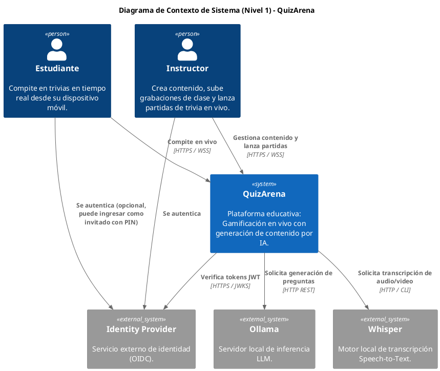
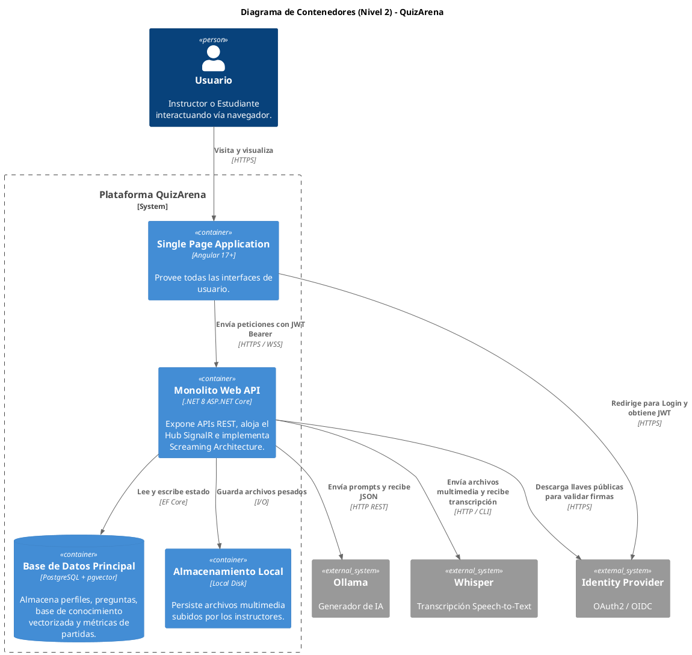

# Modelo C4: QuizArena

Modelo de arquitectura a diferentes niveles de abstracción. El Nivel 1 identifica los actores y sistemas externos. El Nivel 2 desglosa la infraestructura técnica desplegable.

---

## 1. Diagrama de Contexto (Nivel 1)

---

## 2. Diagrama de Contenedores (Nivel 2)

---

## 3. Flujos Críticos Revelados por el Nivel 2

1. **Pipeline de IA Asíncrono:**
   El contenedor Web API recibe un archivo multimedia del SPA, lo guarda en Storage, lo envía a Whisper para transcripción, y finalmente alimenta a Ollama con el texto resultante. Todo este flujo es asíncrono y gestionado mediante Background Workers para no bloquear las partidas en vivo.

2. **Cuello de Botella en el Disco:**
   Si múltiples instructores suben grabaciones simultáneamente, el disco local sufrirá saturación I/O. Se debe considerar almacenamiento externo para V2.

3. **Persistencia Transaccional Estricta:**
   Todos los eventos del juego pasan por la Web API hacia la base de datos. El cliente nunca escribe directamente ni calcula puntos; la Web API es el árbitro absoluto del tiempo.
