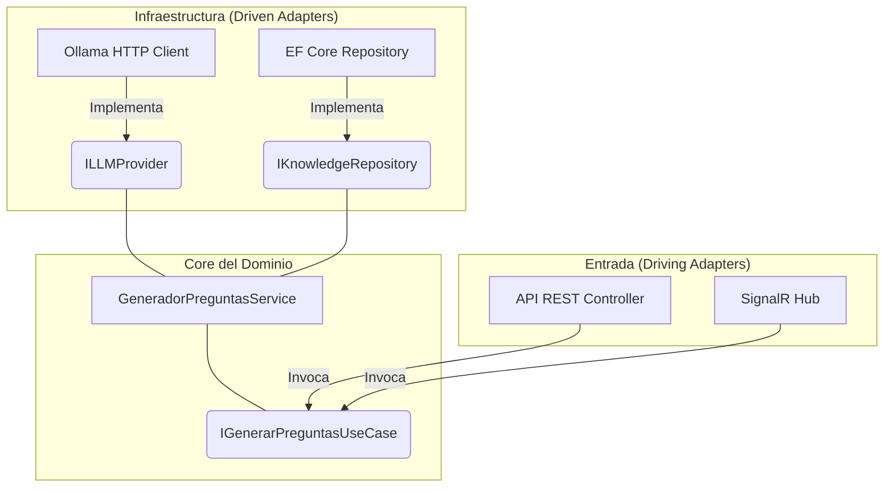

# Technical Design Document (TDD)
**Proyecto:** QuizArena  
**Autor:** Ingeniería / Arquitectura  
**Estado:** Draft  
**Fecha:** Mayo 2026  

---

## 1. Contexto y Alcance

QuizArena es una plataforma educativa de trivia competitiva N-vs-N que integra generación de cuestionarios dinámicos mediante Inteligencia Artificial. Este documento define la arquitectura de software, infraestructura y modelo de datos necesarios para soportar los requerimientos del PRD.

## 2. Objetivos y Restricciones

### Objetivos
- Desarrollar un backend altamente cohesivo pero desacoplado que permita el desarrollo en paralelo.
- Soportar sincronización de eventos en milisegundos para garantizar equidad competitiva.
- Mantener los costos operativos iniciales cercanos a cero utilizando modelos LLM Open Source y WebSockets nativos.
- Establecer una arquitectura agnóstica al almacenamiento y a proveedores externos.

### Fuera de Alcance Técnico
- Diseñar una arquitectura de microservicios distribuidos desde el día 1. Se optará por un monolito modular.
- Implementar streaming de video nativo en el MVP. Se planifica para V2 mediante WebRTC.

---

## 3. Arquitectura de Alto Nivel

El sistema se construye bajo un patrón de **Monolito Modular** utilizando **Screaming Architecture**.

### Stack Tecnológico
- **Backend:** .NET 8, ASP.NET Core Web API
- **Frontend:** Angular 17+
- **Base de Datos:** PostgreSQL con extensión `pgvector`, Entity Framework Core
- **Tiempo Real:** SignalR
- **Inferencia de IA:** Ollama
- **Transcripción de Audio:** Whisper

### Tecnologías Planificadas para V2
- **Streaming:** WebRTC API nativa del navegador

---

## 4. Componentes del Sistema

La solución física `QuizArena.sln` está dividida en dominios de negocio, cada uno implementando Arquitectura Hexagonal de manera aislada:

1. **`QuizArena.Identity`**
   - Autenticación delegada, validación JWT, autorización basada en roles.
2. **`QuizArena.Assessment`**
   - Curación de preguntas AI-First, gestión del banco de preguntas.
3. **`QuizArena.LiveArena`**
   - Partidas N-vs-N, sincronización de timers, cálculos de puntaje, Leaderboards en vivo.
4. **`QuizArena.AIKnowledge`**
   - Ingesta multimedia, transcripción con Whisper, orquestación de prompts hacia Ollama, revisión de borradores.

### Diagrama de Aislamiento (Arquitectura Hexagonal)
Dentro de cada módulo, la lógica de negocio está aislada mediante Puertos:

---

## 5. Modelo de Datos y Almacenamiento

Las tablas estarán en la misma base de datos PostgreSQL, separadas lógicamente mediante schemas:
- **Schema Identity:** `Users`, `Roles`.
- **Schema Assessment:** `Questions`, `QuestionBanks`.
- **Schema LiveArena:** `Matches`, `PlayerResponses` (entidad inmutable para auditoría).
- **Schema AIKnowledge:** `TranscriptJobs`, `KnowledgeChunks`, `DraftQuestions`.

---

## 6. Decisiones Técnicas Clave

### 6.1. Integración de IA
- **Decisión:** Ollama con modelo local bajo la interfaz `ILLMProvider`.
- **Alternativa Descartada:** OpenAI GPT-4o. Rechazada por costo operativo en fase de desarrollo. La Arquitectura Hexagonal permite intercambiar el proveedor cambiando una sola línea de Inyección de Dependencias.

### 6.2. Concurrencia de Juego
- **Decisión:** ASP.NET Core SignalR.
- **Justificación:** Comunicación bidireccional instantánea. El servidor de SignalR es la única fuente de verdad para los timestamps, evitando trampas del lado del cliente.

### 6.3. Transcripción Multimedia
- **Decisión:** Whisper ejecutándose como proceso local o contenedor.
- **Justificación:** Permite convertir grabaciones de clase en texto plano para alimentar a Ollama, completando el pipeline de generación AI-First.

---

## 7. Seguridad y Autenticación

- **Autenticación:** Tokens JWT validados contra las llaves públicas del Identity Provider (JWKS endpoint).
- **Autorización:** Claims-based. Solo usuarios con el rol `instructor` pueden acceder a los endpoints de `QuizArena.AIKnowledge` y crear salas.
- **Validación:** Toda entrada es sanitizada para evitar inyecciones.

---

## 8. Despliegue y CI/CD

- **Contenedores:** El backend .NET se empaqueta en un contenedor Docker.
- **Orquestación Local:** Un archivo `docker-compose.yml` levanta el Backend, PostgreSQL con pgvector, y un contenedor de Ollama pre-cargado con el modelo seleccionado.
- **CI/CD:** GitHub Actions para compilar y ejecutar pruebas unitarias sobre la capa de dominio.
